<picture>
  <source media="(max-width: 600px) and (prefers-reduced-motion: reduce) and (prefers-color-scheme: dark)" srcset="assets/hero-dark-compact-static.svg">
  <source media="(max-width: 600px) and (prefers-reduced-motion: reduce)" srcset="assets/hero-light-compact-static.svg">
  <source media="(max-width: 600px) and (prefers-color-scheme: dark)" srcset="assets/hero-dark-compact.svg">
  <source media="(max-width: 600px)" srcset="assets/hero-light-compact.svg">
  <source media="(prefers-reduced-motion: reduce) and (prefers-color-scheme: dark)" srcset="assets/hero-dark-static.svg">
  <source media="(prefers-reduced-motion: reduce)" srcset="assets/hero-light-static.svg">
  <source media="(prefers-color-scheme: dark)" srcset="assets/hero-dark.svg">
  
</picture>

<!-- social:start -->

<!-- social:end -->

## Agora

- **Genesis Work Company**, fundador e CEO. Transformamos marketing em sistema usando IA, dados e automação. [genesiswork.company](https://genesiswork.company)
- **ORACTIA**, cofundador e CEO. CRM, atendimento, automações e IA em um só sistema. [oractia.com.br](https://oractia.com.br)
- **LuminaSoft**, cofundador. Software house com três sócios fundadores que escrevem o código: sistemas, plataformas, automações e dashboards sob medida. [luminasoft.com.br](https://luminasoft.com.br)
  - **flatt**, produto da LuminaSoft. Inferência de modelos de linguagem por preço fixo mensal, sem contagem de token. [flatt.com.br](https://flatt.com.br)

## Foco atual

- 🤖 **IA aplicada a produtos reais:** agentes, MCP e automações dentro da operação das empresas e dos produtos.
- 🧩 **ORACTIA:** conversas, vendas e pós-venda sobre o mesmo histórico do cliente, com implantação acompanhada.
- ⚡ **flatt:** inferência com preço previsível e contexto de 262 mil tokens.
- 🛠️ **UIport:** CLI open source que roda localmente, do terminal ou de um agente de código.
- ⚙️ **Automação e sistemas:** integrações, automações e dashboards sob medida, e e-commerce com Shopify e Bling ERP.

## Open source

<a href="https://github.com/LorranHippolyte/uiport">
  <picture>
    <source media="(max-width: 600px) and (prefers-color-scheme: dark)" srcset="https://raw.githubusercontent.com/LorranHippolyte/lorranhippolyte/output/uiport-dark-compact.svg">
    <source media="(max-width: 600px)" srcset="https://raw.githubusercontent.com/LorranHippolyte/lorranhippolyte/output/uiport-light-compact.svg">
    <source media="(prefers-color-scheme: dark)" srcset="https://raw.githubusercontent.com/LorranHippolyte/lorranhippolyte/output/uiport-dark.svg">
    
  </picture>
</a>

**[UIport](https://github.com/LorranHippolyte/uiport)**: *Bring a rendered web section into your next project as editable HTML, CSS and local assets.* CLI local, sem conta e sem chave de API, que compara a cópia com a fonte em vários tamanhos de tela. MIT · [npm](https://www.npmjs.com/package/uiport)

**Contribuições:** [vinilana/dotcontext#41](https://github.com/vinilana/dotcontext/pull/41) (merged)

## Como eu trabalho

> Empresa não cresce por mais esforço, cresce por sistema.

- Formação em TI, com especializações em Análise de Sistemas e Banco de Dados, somada a anos de marketing, growth e dados.
- Opero IA no dia a dia: agentes, MCP e Claude Code orquestrando o desenvolvimento e a operação das empresas.
- Shopify Partner · Parceiro Bling ERP · Embaixador AI Coders Academy
- Marido e pai de seis.

## Aprendizado contínuo

- 📚 **Base sólida:** fundamentos de sistemas e banco de dados aplicados à arquitetura: monorepos, tipagem de ponta a ponta e testes automatizados.
- 🧪 **Aplicação prática:** o que estudo vira coisa no ar: UIport publicado no npm, flatt e ORACTIA com sites públicos.
- 🤝 **Comunidade e troca:** Embaixador da AI Coders Academy e contribuição em open source, com PR mergeado no dotcontext.

## Stack em uso

<!-- stack:start -->
**Produto**

<picture><source media="(prefers-color-scheme: dark)" srcset="assets/badges/typescript-dark.svg"></picture>
<picture><source media="(prefers-color-scheme: dark)" srcset="assets/badges/react-19-dark.svg"></picture>
<picture><source media="(prefers-color-scheme: dark)" srcset="assets/badges/next-js-16-dark.svg"></picture>
<picture><source media="(prefers-color-scheme: dark)" srcset="assets/badges/astro-dark.svg"></picture>
<picture><source media="(prefers-color-scheme: dark)" srcset="assets/badges/tailwind-css-v4-dark.svg"></picture>
<picture><source media="(prefers-color-scheme: dark)" srcset="assets/badges/shadcn-ui-dark.svg"></picture>
<picture><source media="(prefers-color-scheme: dark)" srcset="assets/badges/gsap-dark.svg"></picture>
<picture><source media="(prefers-color-scheme: dark)" srcset="assets/badges/motion-dark.svg"></picture>

**Back-end e dados**

<picture><source media="(prefers-color-scheme: dark)" srcset="assets/badges/hono-dark.svg"></picture>
<picture><source media="(prefers-color-scheme: dark)" srcset="assets/badges/fastify-dark.svg"></picture>
<picture><source media="(prefers-color-scheme: dark)" srcset="assets/badges/trpc-dark.svg"></picture>
<picture><source media="(prefers-color-scheme: dark)" srcset="assets/badges/drizzle-dark.svg"></picture>
<picture><source media="(prefers-color-scheme: dark)" srcset="assets/badges/prisma-dark.svg"></picture>
<picture><source media="(prefers-color-scheme: dark)" srcset="assets/badges/better-auth-dark.svg"></picture>
<picture><source media="(prefers-color-scheme: dark)" srcset="assets/badges/postgresql-dark.svg"></picture>
<picture><source media="(prefers-color-scheme: dark)" srcset="assets/badges/neon-dark.svg"></picture>
<picture><source media="(prefers-color-scheme: dark)" srcset="assets/badges/tanstack-query-dark.svg"></picture>

**Infra**

<picture><source media="(prefers-color-scheme: dark)" srcset="assets/badges/cloudflare-workers-dark.svg"></picture>
<picture><source media="(prefers-color-scheme: dark)" srcset="assets/badges/cloudflare-d1-dark.svg"></picture>
<picture><source media="(prefers-color-scheme: dark)" srcset="assets/badges/docker-dark.svg"></picture>
<picture><source media="(prefers-color-scheme: dark)" srcset="assets/badges/dokploy-dark.svg"></picture>
<picture><source media="(prefers-color-scheme: dark)" srcset="assets/badges/turborepo-dark.svg"></picture>
<picture><source media="(prefers-color-scheme: dark)" srcset="assets/badges/pnpm-dark.svg"></picture>
<picture><source media="(prefers-color-scheme: dark)" srcset="assets/badges/biome-dark.svg"></picture>
<picture><source media="(prefers-color-scheme: dark)" srcset="assets/badges/vitest-dark.svg"></picture>
<picture><source media="(prefers-color-scheme: dark)" srcset="assets/badges/playwright-dark.svg"></picture>

**E-commerce**

<picture><source media="(prefers-color-scheme: dark)" srcset="assets/badges/shopify-dark.svg"></picture>
<picture><source media="(prefers-color-scheme: dark)" srcset="assets/badges/liquid-dark.svg"></picture>
<picture><source media="(prefers-color-scheme: dark)" srcset="assets/badges/bling-erp-dark.svg"></picture>

**IA**

<picture><source media="(prefers-color-scheme: dark)" srcset="assets/badges/vercel-ai-sdk-dark.svg"></picture>
<picture><source media="(prefers-color-scheme: dark)" srcset="assets/badges/mcp-dark.svg"></picture>
<picture><source media="(prefers-color-scheme: dark)" srcset="assets/badges/claude-code-dark.svg"></picture>
<picture><source media="(prefers-color-scheme: dark)" srcset="assets/badges/codex-dark.svg"></picture>

<!-- stack:end -->

## Atividade no GitHub

<picture>
  <source media="(max-width: 600px) and (prefers-reduced-motion: reduce) and (prefers-color-scheme: dark)" srcset="https://raw.githubusercontent.com/LorranHippolyte/lorranhippolyte/output/stats-dark-compact-static.svg">
  <source media="(max-width: 600px) and (prefers-reduced-motion: reduce)" srcset="https://raw.githubusercontent.com/LorranHippolyte/lorranhippolyte/output/stats-light-compact-static.svg">
  <source media="(max-width: 600px) and (prefers-color-scheme: dark)" srcset="https://raw.githubusercontent.com/LorranHippolyte/lorranhippolyte/output/stats-dark-compact.svg">
  <source media="(max-width: 600px)" srcset="https://raw.githubusercontent.com/LorranHippolyte/lorranhippolyte/output/stats-light-compact.svg">
  <source media="(prefers-reduced-motion: reduce) and (prefers-color-scheme: dark)" srcset="https://raw.githubusercontent.com/LorranHippolyte/lorranhippolyte/output/stats-dark-static.svg">
  <source media="(prefers-reduced-motion: reduce)" srcset="https://raw.githubusercontent.com/LorranHippolyte/lorranhippolyte/output/stats-light-static.svg">
  <source media="(prefers-color-scheme: dark)" srcset="https://raw.githubusercontent.com/LorranHippolyte/lorranhippolyte/output/stats-dark.svg">
  
</picture>

English summary

I build growth systems where marketing, technology and AI meet. I'm the founder and CEO of **Genesis Work Company**, which turns marketing into a system with AI, data and automation. I'm co-founder and CEO of **ORACTIA**, which puts CRM, customer service, automation and AI in a single system. I'm also co-founder of **LuminaSoft**, a software house whose founders write the code. Its product, **flatt**, offers language-model inference at a flat monthly price.

In open source I maintain **[UIport](https://github.com/LorranHippolyte/uiport)**, a local CLI that brings a rendered web section into your project as editable HTML, CSS and local assets.

